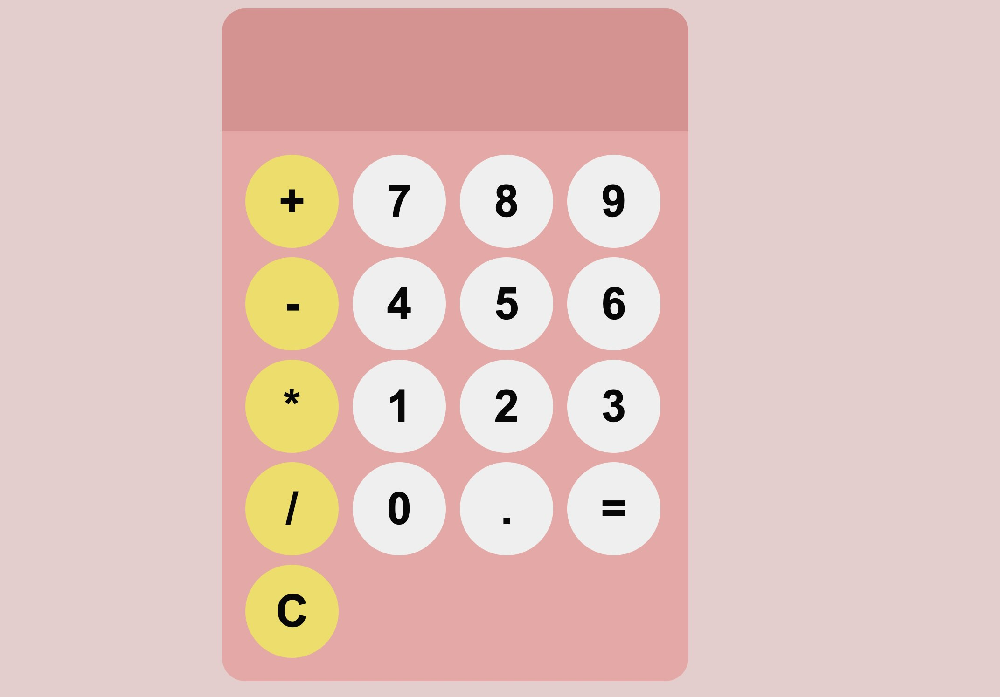

# Simple Calculator

## Introduction
This project is a simple calculator built with HTML, CSS, and JavaScript. It's designed for beginners who are looking to get hands-on experience with web development. This calculator can perform basic arithmetic operations like addition, subtraction, multiplication, and division.

Live Demo: [Simple Calculator](https://aneesa200.github.io/Calculator-using-HTML-CSS-JS)



## Features
- **Basic Operations:** Perform addition, subtraction, multiplication, and division.
- **Responsive Design:** Works on both desktop and mobile devices.
- **Clear Interface:** Easily clear the input or reset the calculator with a single click.

## How to Use
1. Visit the [live project link](https://aneesa200.github.io/Calculator-using-HTML-CSS-JS).
2. Click on the numbers and operations to perform calculations.
3. Use the "C" button to clear the last entry and the "AC" button to reset the calculator.

## Local Setup
If you want to run this project locally on your machine, follow these steps:

1. Clone the repository:
   ```bash
   git clone https://github.com/aneesa200/Calculator-using-HTML-CSS-JS.git

